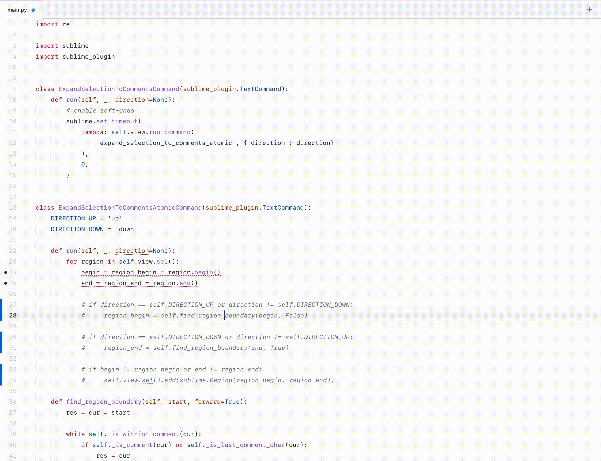

[](https://stand-with-ukraine.pp.ua)

# Expand Selection to Comments



Expands the current selection to the nearest comment block

- works with multiple cursors
- supports soft undo
- supports comments divided with empty lines
- works with any language that has syntax highlighting

## Installation

1. Install the [Sublime Text Package Control](https://packagecontrol.io/) package if it is not yet installed.
2. Open the command palette and start typing `Package Control: Install Package`.
3. Enter `ExpandSelectionToComments`.

## Usage

The package exposes a single command: `expand_selection_to_comments`.  
It can be bound to a key combination or invoked from the command palette.

```json
{ "keys": ["ctrl+shift+/"], "command": "expand_selection_to_comments" }
```

The command also accepts an optional `direction` argument that can be used to change the direction of the selection: 

- `up` from the current position to the beginning of the comment block
- `down` from the current position to the end of the comment block.

```json
{ "keys": ["ctrl+shift+alt+/"], "command": "expand_selection_to_comments", "args": { "direction": "down" } },
{ "keys": ["ctrl+shift+super+/"], "command": "expand_selection_to_comments", "args": { "direction": "up" } },
```

## Implementation details

The command relies on the syntax highlighting information provided by Sublime Text which means that it can be used with any language that has syntax highlighting.

